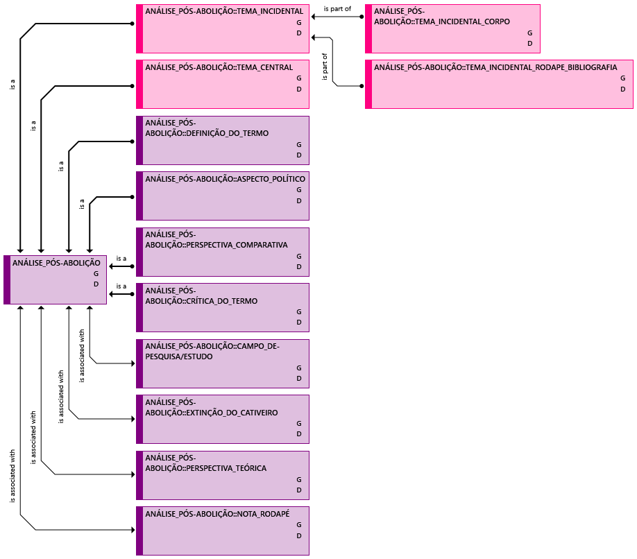
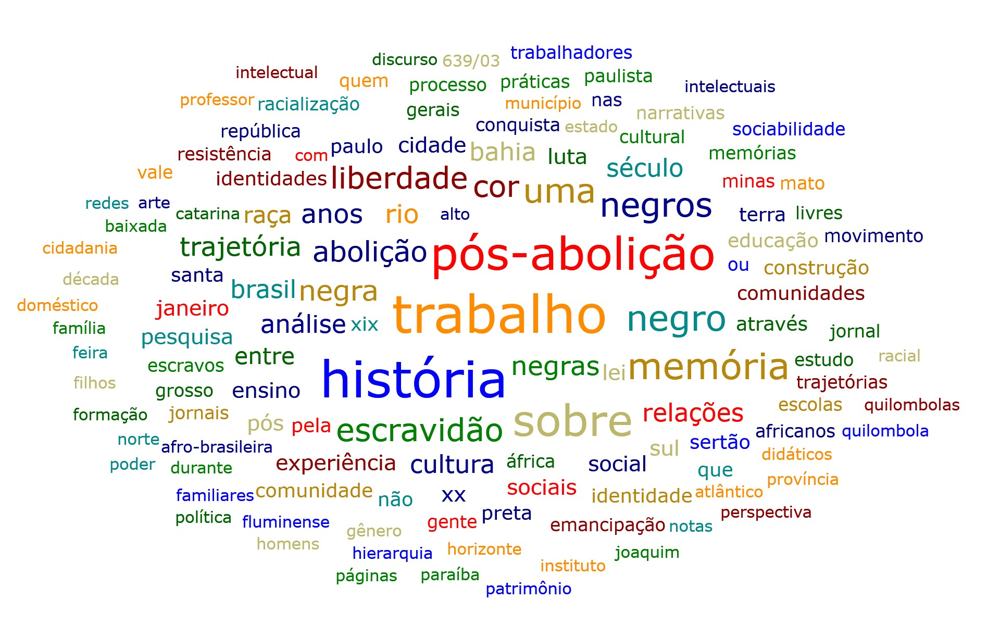

# Pibic - Pós-Abolição

Bolsista: Priscila

## Análise dos dados do projeto do Atlas.ti

## 1. Introdução

* Apresentar a árvore de código e as estratégias de codificação
* objetivos da codificação e a análise que será feita.

## 2. Análise dos dados quantitativos

* Apresentar o total de papers com menção ao `pós-abolição`: soma dos códigos `TEMA CENTRAL` e `TEMA INCIDENTAL` 
* Explicar o que define os códigos `TEMA CENTRAL` e `TEMA INCIDENTAL`

### 2.1. Eventos

* Caracterizar os eventos;
*  Gráfico com os dados de cada evento.

[inserir gráfico 1]

* Pensar se esse dado é relevante para a análise.

### 2.2. Instituições e Formação

* Apresentar os dados de instituições e formação dos/as autores, diferenciando entre tema central e tema incidental.

[inserir gráfico 2: Formação X Tema Central]

[inserir gráfico 3: Formação X Tema Incidental]

[inserir gráfico 4: Instituição X Tema Central]

[inserir gráfico 5: Instituição X Tema Incidental]

## 3. Análise dos sentidos

### 3.1. Árvore de códigos

* Explicar o que é a árvore de códigos e como foi construída, quais os critérios de cada código.
* Apresentar os dados de cada código.

[inserir rede de códigos]

### 3.2. Reflexões sobre os usos do termo Pós-Abolição

* Como tema central, como aparece?
* Como tema incidental, como aparece?
* Há diferenças significativas?
* Como os autores utilizam o termo Pós-Abolição?

[inseri gráfico 6: `Análise`]

Nuvem de palavras dos títulos dos papers com menção ao `pós-abolição`

Nuvem de palavras dos papers codificados como `TEMA CENTRAL`

## 4. Usos na pesquisa em história

Caracterizaremos os usos do termo Pós-Abolição na pesquisa em história, apresentado dados para os recortes temporal, espacial e temático.

### 4.1 Recorte Temporal
* Códigos e como foram aplicados
* Gráfico

### 4.2 Recorte Espacial
* Códigos e como foram aplicados
* Gráfico

### 4.3 Temáticas principais
* Códigos e como foram aplicados
* Gráfico

## 5. Considerações finais

O que a análise permite concluir sobre os usos e sentidos do pós-abolição (através do dataset dos papers da Anpuh)?
